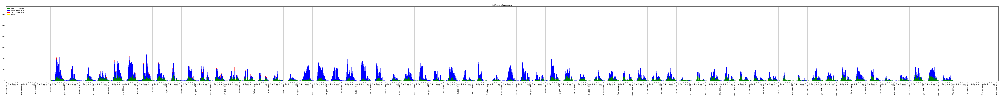
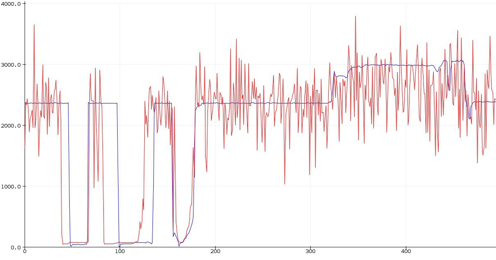

# Orcatech DH Project Report

National University Of Singapore, Residential College 4

Done by:
- Yow Keng Yee Samuel (Class of 2024)
- Manzel Joseph Seet (Class of 2023)

Supervised by:
- Prof Naviyn Prabhu Balakrishnan

## Rationale

This project was started in AY2021/2022 Sem 2 when the Dinning Hall capacity was reduced due to Covid-19 Safe Management Measures. As the Dinning Hall could get quite crowded with long queues, we proposed the idea of utlising sensors at the doors of the dinning hall to track people coming into and out of the Dinning Hall so as to calculate the current number of people at any point in time. This would allows residents to make informed decsions on when to come down to get their food.

## List of Items Purchased
- VLX53L0X Laser Ranging Time Of Flight Sensor 
- VL53l1X Laser Ranging Time Of Flight Sensor
- Generic Dual USB Charger 
- Generic MircoUSB Cable
- ESP32 Dev Kit
- Raspberry Pi 3B
- High gain Wireless USB Adaptor TP Link [shoppee](https://shopee.sg/TP-Link-TL-WN722N-150-Mbps-High-Gain-Wireless-USB-Adapter-White-TPLink-i.101600.2161518348)
- [JLCPCB](https://jlcpcb.com/) - PCB Printing Service

## Relevant Links
- VL53L0X Laser Ranging Time Of Flight Sensor
    - Github [Library](https://github.com/adafruit/Adafruit_VL53L0X) 
    - Adafruit [Tutorial](https://learn.adafruit.com/adafruit-vl53l0x-micro-lidar-distance-sensor-breakout)
- ESP32
    - Over The Air Update (OTA) [Tutorial](https://randomnerdtutorials.com/esp32-over-the-air-ota-programming/)

## Fabrication and Installation

[EasyEDA](https://easyeda.com/) was used to design the PCB, which contained the ESP32s and the VLX distance sensors. This was sent over to JLCPCB to be printed. However, the ESP32 did not fit the PCB exactly. Hence, the base of female pin headers was bent and sodlered on top of the through holes.

For the casing, PLA filament with a 3D printer was used to prototype various methods of encasing the PCB. We initially tried using friction fitting but it was hard to get an accurate fit and we realised it might encourage tampering as any resident could remove a friction fit. Hence, our final iteration used screws to secure the cover.

The casing was mounted on to the pillars of the Dinning Hall using mounting tape. Transparent tape was used to tape down the wires to the walls. From some initial testing, we made some observations, which can be improved upon during the next iteration
- Mounting Tape is quite permanant and when taken out, paint is removed as well.
- The cover was cut as it seemed to block the VLX sensor's line of vision.
- One of the ESP32s were damanaged when the USB port broke off. We believe someone accidentally presed against it leading to the USB port being removed from the ESP32 board. Hence, that board needed to be swapped out. As such, future iterations need to consider such a scenario.
- After a month of installation, the wires and tape accumulated dust. A more permanant installation should be considered

## Data

Data was collected for around 2 months, and plotted using the `graph_plotter.py` file. The raw data is also attached in the src folder [here](src/DHCapacityRecords.csv).

From testing at night, we had a success rate of around 70% with very few false triggers. This was done by shifting the sensors away from the door. Its shiny handle was suspected to cause the false triggering. From the data collected over a few days, the two sensors at the main doors were found to be quite inaccurate. From the data, the number of people going in appeared to peak at around 12pm. The sensor at the side door seemed to be working fine. We suspected that the anamolies were due to UV rays from the sun which peaked that that timing. As the side door seemed to work fine, the inaccuracies of the sensor could also be due to the wide width of the main doors. 

We purchased the VLX53L1X to test this due to its higher range of 30mm to 4000mm. However, we found the sensor to be unreliable, with 3 out of 4 sensors being extremely noisy. The blue line in the graph below represents the good esnsor while the red line is the noisy sensor.

