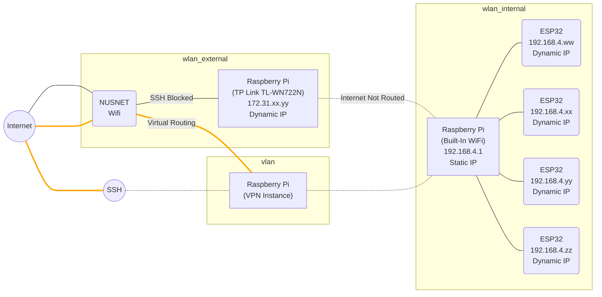

# Raspberry Pi Setup

## Network Architecture

As the ESP32s are unable to connect to WPA2-Enterprise networks, the Raspberry Pi hosts a WPA2-Personal network using the built-in WiFi interface card `wlan_internal` to creates an intranet hotspot. Using the hotspot, one can SSH into the Raspberry Pi. The Raspberry Pi also hosts an MQTT broker for the ESP32s communicate sensor information in real time. Since the ESP32s do not require internet access, no routing is done to `wlan_internal` and it is an isolated intranet. This also serves as a security feature to prevent external attacks on these IoT devices. For the Telegram Bot, the Raspberry Pi uses an external WiFi USB adapter (TP Link TL-WN722N) `wlan_external` to connect to the NUSNET WiFi and the internet. Note that NUSNET blocks SSH access within the network. Hence to access the Raspberry Pi, either connect to the intranet hotspot, or setup a virtual private network to route it out.



## Setup instructions

### Prepare Hardware

Hardware

- Raspberry Pi 3 Model B+
- TP Link TL-WN722N 150 Mbps High Gain Wireless USB Adapter

Install official Raspberry Pi OS.

### Change hostname

Go to `sudo raspi-config` and change hostname to `orcatechdiningpi`

After rebooting, we can SSH using the hostname from now on
    
    sshpass -p raspberry ssh pi@orcatechdiningpi.local

### Setup Wifi Hardware

Connect TP Link TL-WN722N to USB port. Drivers are pre-installed on the official OS so it is plug-and-play.

Check that USB is detected

    $ lsusb
    Bus 001 Device 004: ID 2357:010c TP-Link TL-WN722N v2/v3 [Realtek RTL8188EUS]

Check which interface belongs to which hardware. We can also get the MAC address of each device.

    $ ethtool -i wlan0
        driver: r8188eu
        version: 5.10.63-v7+

    $ ethtool -i wlan1
        driver: brcmfmac
        version: 7.45.229

    $ ip link
        3: wlan0: <BROADCAST,MULTICAST> mtu 1500 qdisc noop state DOWN mode DEFAULT group default qlen 1000
            link/ether 14:eb:b6:95:2f:2c brd ff:ff:ff:ff:ff:ff
        4: wlan1: <NO-CARRIER,BROADCAST,MULTICAST,UP> mtu 1500 qdisc pfifo_fast state DOWN mode DORMANT group default qlen 1000
            link/ether b8:27:eb:90:61:28 brd ff:ff:ff:ff:ff:ff

In this case, `wlan0` belongs to the USB adapter and `wlan1` is the built-in Wifi. Note that the numbers (`wlan0` and `wlan1`) may swap around sometimes, so let's fix a permanent name.

Let the USB adapter be called `wlan_external` and the built-in Wifi be `wlan_internal`

Make a rule in `rules.d` directory to set a name based on the adapter's MAC address.

    echo 'SUBSYSTEM=="net", ACTION=="add", DRIVERS=="?*", ATTR{address}=="14:eb:b6:95:2f:2c", ATTR{dev_id}=="0x0", ATTR{type}=="1", NAME="wlan_external"'  | sudo tee /etc/udev/rules.d/70-wlan_external.rules

    echo 'SUBSYSTEM=="net", ACTION=="add", DRIVERS=="?*", ATTR{address}=="b8:27:eb:90:61:28c", ATTR{dev_id}=="0x0", ATTR{type}=="1", NAME="wlan_internal"'  | sudo tee /etc/udev/rules.d/70-wlan_internal.rules

Reboot the Raspberry Pi. Verify that the name is persistent even after replugging the USB adapter.

    $ ip link
        3: wlan_internal: <BROADCAST,MULTICAST,UP,LOWER_UP> mtu 1500 qdisc pfifo_fast state UP mode DEFAULT group default qlen 1000
            link/ether b8:27:eb:90:61:28 brd ff:ff:ff:ff:ff:ff
        4: wlan_external: <NO-CARRIER,BROADCAST,MULTICAST,UP> mtu 1500 qdisc mq state DOWN mode DORMANT group default qlen 1000
            link/ether 14:eb:b6:95:2f:2c brd ff:ff:ff:ff:ff:ff
        
Test that the device can scan for surrounding Wifi SSIDs

    sudo iwlist wlan_external scan


### Setup Intranet Hotspot

Adapted from these guides:

- https://www.raspberrypi.com/documentation/computers/configuration.html#setting-up-a-routed-wireless-access-point
- https://learn.adafruit.com/setting-up-a-raspberry-pi-as-a-wifi-access-point/install-software

#### Install AP and Management Software

    sudo apt install hostapd
    sudo systemctl unmask hostapd
    sudo systemctl enable hostapd
    sudo apt install dnsmasq
    sudo DEBIAN_FRONTEND=noninteractive apt install -y netfilter-persistent iptables-persistent

#### Set up the Network Router

As the dining network will be an intranet, we just need to set a static IP network but do not need to do any routing.

    sudo nano /etc/dhcpcd.conf

Go to the end of the file and add the following:

    interface wlan_internal
        static ip_address=192.168.4.1/24
        nohook wpa_supplicant

#### Configure the DHCP and DNS services for the wireless network

We set up DHCP in the dining network so the ESP32s will get their own IP addresses.

Rename the default configuration file and edit a new one:

    sudo mv /etc/dnsmasq.conf /etc/dnsmasq.conf.orig
    sudo nano /etc/dnsmasq.conf

Add the following to the file and save it. 

    interface=wlan_internal # Listening interface
    dhcp-range=192.168.4.2,192.168.4.254,255.255.255.0,24h
                    # Pool of IP addresses served via DHCP
    domain=wlan     # Local wireless DNS domain
    address=/orcatechdiningpi.wlan/192.168.4.1
                    # Alias for this router

The above configuration means the Raspberry Pi will deliver Class C IP addresses between `192.168.4.2` and `192.168.4.254`, with a lease time of 24 hours, to wireless DHCP clients.

The Raspberry Pi acts as a router at the address `192.168.4.1` and hostname `orcatechdiningpi.wlan`.

#### Configure the AP Software

Create the hostapd configuration file, located at `/etc/hostapd/hostapd.conf`, to add the various parameters for your new wireless network.

    sudo nano /etc/hostapd/hostapd.conf

Set the configuration to the following. Note the SSID (`orcatech_dining_bot`) and passphrase (`ORCATECH_DINING_BOT_PASSWORD`) of our dining network.

    country_code=SG
    interface=wlan_external
    ssid=orcatech_dining_bot
    hw_mode=g
    channel=7
    macaddr_acl=0
    auth_algs=1
    ignore_broadcast_ssid=0
    wpa=2
    wpa_passphrase=ORCATECH_DINING_BOT_PASSWORD
    wpa_key_mgmt=WPA-PSK
    wpa_pairwise=TKIP
    rsn_pairwise=CCMP
    max_num_sta=100

Check both services are active

    sudo service dnsmasq status
    sudo service hostapd status

### Setup Internet Wifi

The TP Link TL-WN722N does not support the default wpa_supplicant driver (`nl80211`) in access point mode. [Manually change to the `wext` driver](https://unix.stackexchange.com/questions/558081/manually-set-wpa-supplicant-driver) instead.

Add this to the end of `/etc/dhcpcd.conf`. Note that the DNS servers must be set as well, because `dhcpcd` overrides the system `resolv.conf`.
In addition, IPv4 Link-Local address is disabled to speed up DHCP IP address allocation.

    interface wlan_external
        env ifwireless=1
        env wpa_supplicant_driver=wext
        static domain_name_servers=8.8.8.8 4.2.2.1
        nohook resolv.conf
        noipv4ll

    interface eth0
        static domain_name_servers=8.8.8.8 4.2.2.1

Also manually set up domain name server if it gets overridden by dhcpd. `sudo nano /etc/resolv.conf`:

    nameserver 8.8.8.8

#### For WPA2 connections

Instead of putting your plaintext password, generate a passphrase using this command

    wpa_passphrase YOUR_SSID YOUR_PASSWORDS

Create a new file to specify the wifi connection for the interface `wlan_external`. ([Reference](https://superuser.com/questions/469039/wpa-supplicant-for-dual-wlan))

    sudo nano /etc/wpa_supplicant/wpa_supplicant-wlan_external.conf

Copy it to wpa_supplicant.conf

    network={
            ssid="my_wifi_network"
            #psk="helloworld"
            psk=0b6aef02bb483a725f72c64856d3d2677ac1ea6546a602318cad8bbb06ee33f1
    }

#### For WPA2-Enterprise connections

Instead of putting your plaintext password, generate a hash using this command

    echo -n "plaintext_password_here" | iconv -t utf16le | openssl md4 -provider legacy

Use this template instead. Ensure your password is prefixed with `hash:`.

    network={
        ssid="NUS_STU"
        scan_ssid=1
        proto=RSN
        key_mgmt=WPA-EAP
        group=CCMP
        pairwise=CCMP
        auth_alg=OPEN
        eap=PEAP
        phase1="peaplabel=0"
        phase2="auth=MSCHAPV2"
        identity="e1234567"
        password=hash:0123456789abcdef0123456789abcdef
        priority=1
    }

After changing the wpa_supplicant, reload the wifi connection and check if it connects

    wpa_cli -i wlan_external reconfigure
    wpa_cli -i wlan_external status

### Install MQTT broker

Install `mosquitto` and start it.

    sudo apt install mosquitto
    sudo apt install mosquitto-clients
    sudo systemctl enable mosquitto
    sudo systemctl start mosquitto

Allow external connections. Add this to the end of `/etc/mosquitto/mosquitto.conf`.

    listener 1883
    allow_anonymous true

Test that MQTT works between different devices. On another device, run the following:

- Subscribe to the topic: `mosquitto_sub -v -t 'dh_topic/#' -h orcatechdiningpi.local`
- Publish a message: `mosquitto_pub -t 'dh_topic/test/123' -m 'helloWorld' -h orcatechdiningpi.local`

Alternatively, install MQTTX on your PC to test using a GUI

    sudo snap install mqttx

### Start scripts on boot

Install tmuxinator to manage the scripts

    sudo apt install tmux

Add a main launch script in the home directory

    nano /home/pi/BOOT_SCRIPT.sh

Paste this into the BOOT_SCRIPT.sh

```bash
# Debug Left Pane
tmux new-session -d -s Orcatech -n 'Debug'
tmux set -g mouse on
tmux send-keys 'echo $(date)' Enter
tmux send-keys 'cd ~/DH-CrowdTracker' Enter

# Debug Right Pane
tmux split-window -h
tmux send-keys 'cd ~/DH-CrowdTracker' Enter

# MQTT Left Top Pane
tmux new-window -n 'MQTT'
tmux send-keys 'sudo less +F /var/log/mosquitto/mosquitto.log' Enter

# MQTT Right Pane
tmux split-window -h
tmux send-keys 'mosquitto_sub -v -t "dh_topic/#" -F "%I %t %p"' Enter

# MQTT Left Bottom Pane
tmux selectp -t 0
tmux split-window -v
tmux send-keys 'cd ~/DH-CrowdTracker' Enter
tmux send-keys 'bash nmap_script.sh' Enter

# Wifi Left Top Pane
tmux new-window -n 'Wifi'
tmux send-keys 'wpa_cli -i wlan_external status' Enter

# Wifi Right Pane
tmux split-window -h
tmux send-keys 'less +F /var/log/syslog' Enter

# Wifi Left Bottom Pane
tmux selectp -t 0
tmux split-window -v
tmux send-keys 'iw dev wlan_internal station dump' Enter

# Telegram_Bot Left Pane
tmux new-window -n 'Telegram_Bot'
tmux send-keys -t Orcatech:Telegram_Bot 'cd /home/pi/DH-CrowdTracker && while true; do python3 esp32_control_main.py; done' Enter

# Telegram_Bot Right Pane
tmux split-window -h
tmux send-keys -t Orcatech:Telegram_Bot 'cd /home/pi/DH-CrowdTracker && while true; do python3 telegram_main.py; date; done' Enter
```

Now when you SSH in, you can view the session using this

    tmux attach -t Orcatech
    tmux list-sessions

Edit the rc.local script launched on boot

    sudo nano /etc/rc.local

Add the line at the end just before `exit 0`.

    sudo su pi -c "bash /home/pi/BOOT_SCRIPT.sh &"


### Install additional services (optional)

Install zerotier so that we can SSH in remotely. [(Full instructions here)](https://pimylifeup.com/raspberry-pi-zerotier/).

    curl https://raw.githubusercontent.com/zerotier/ZeroTierOne/master/doc/contact%40zerotier.com.gpg | gpg --dearmor | sudo tee /usr/share/keyrings/zerotierone-archive-keyring.gpg >/dev/null
    RELEASE=$(lsb_release -cs)
    echo "deb [signed-by=/usr/share/keyrings/zerotierone-archive-keyring.gpg] http://download.zerotier.com/debian/$RELEASE $RELEASE main" | sudo tee /etc/apt/sources.list.d/zerotier.list
    sudo apt update
    sudo apt install -y zerotier-one

Then join your zerotier network.

    sudo zerotier-cli join [NETWORKID]
    sudo zerotier-cli listnetworks

Install privoxy to have a HTTP proxy for access to `wlan_internal` network over a web browser. [(Full instructions here)](https://www.howtogeek.com/683971/how-to-use-a-raspberry-pi-as-a-proxy-server-with-privoxy/).

    sudo apt install -y privoxy
    sudo nano /etc/privoxy/config    # Replace the line with the following: `listen-address :8118`
    sudo systemctl restart privoxy
    sudo systemctl status privoxy

Now connect by setting your PC web browser to point to the following HTTP proxy

    orcatechdiningpi.local:8118
